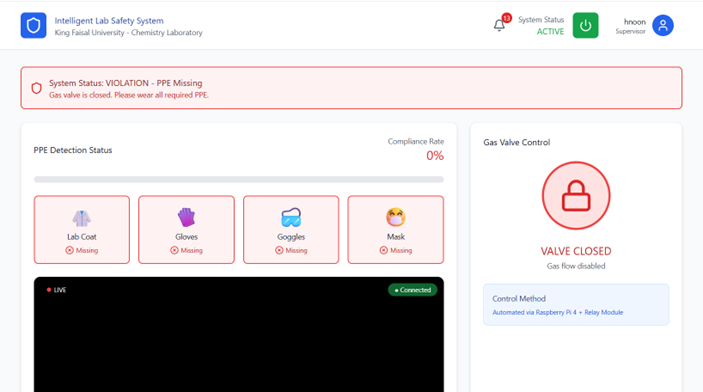
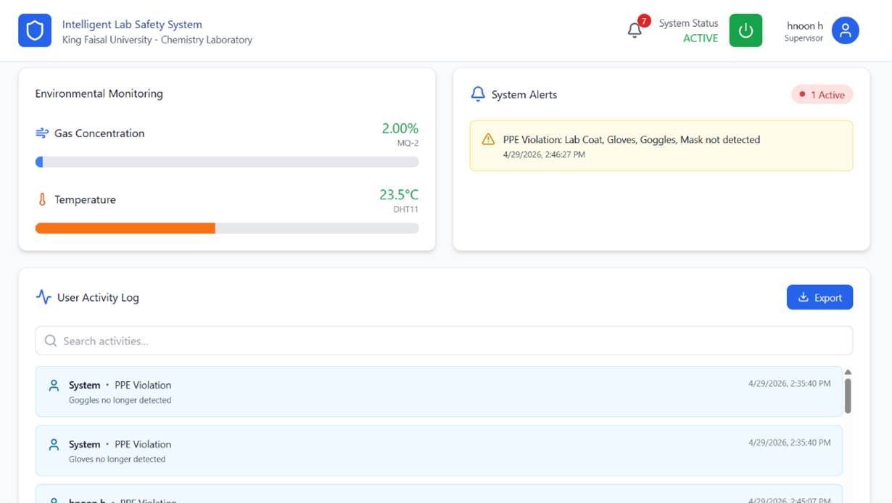

# 🥼 Intelligent Lab Safety System

> **Real-time PPE monitoring and fume hood control for chemistry laboratories**  
> Graduation Project — King Faisal University, College of Computer Sciences and Information Technology, 2026

---

##  Table of Contents

- [About the Project](#about-the-project)
- [Demo](#demo)
- [System Architecture](#system-architecture)
- [Features](#features)
- [Tech Stack](#tech-stack)
- [Project Structure](#project-structure)
- [Getting Started](#getting-started)
- [Hardware Setup (Optional)](#hardware-setup-optional)
- [Dataset](#dataset)
- [Training the Model](#training-the-model)
- [Team](#team)

---

## About the Project

The **Intelligent Lab Safety System** monitors chemistry laboratory personnel in real time using computer vision. A YOLOv11 model analyzes live webcam frames and detects whether each person is wearing the required **Personal Protective Equipment (PPE)**: lab coat, gloves, goggles, and mask.

Environmental sensors on a Raspberry Pi 4 measure **gas concentration** and **temperature**. When hazardous gas levels are detected, the system automatically controls a **relay-operated gas valve** to shut off the fume hood.

A web dashboard gives supervisors a live camera feed, PPE compliance status per person, environmental readings, automated alerts, a full event log, and CSV export.

> Presented at **I²Tech 2026** and the **Technical Competencies Forum 2026**, King Faisal University.

---

## Demo

| Live PPE Detection | Dashboard Overview |
|---|---|
|  |  |

---

## System Architecture

```
┌─────────────────────────────────────────────────────┐
│              React + TypeScript Dashboard            │
│  (Webcam capture → WebSocket → overlay rendering)   │
└────────────────────┬────────────────────────────────┘
                     │ WebSocket ws://localhost:8765
                     │ HTTP API  http://localhost:8766
┌────────────────────▼────────────────────────────────┐
│               Python Backend  (server.py)            │
│  YOLOv11 inference │ SQLite database │ REST API      │
└────────────────────┬────────────────────────────────┘
                     │ POST /api/sensor-data
┌────────────────────▼────────────────────────────────┐
│            Raspberry Pi 4  (optional)                │
│   DHT11 (temperature) │ MQ-2 (gas) │ Relay module   │
└─────────────────────────────────────────────────────┘
```

---

## Features

-  **Real-time PPE detection** — detects lab coat, gloves, goggles, mask using YOLOv11
-  **Automatic violation logging** — saves a snapshot and logs every violation to the database
-  **Environmental monitoring** — live gas and temperature readings from Raspberry Pi sensors
-  **Gas valve control** — relay module automatically shuts the fume hood on hazardous gas levels
-  **Supervisor dashboard** — live camera feed, compliance status, alerts, event history
-  **CSV export** — download complete event logs with one click
-  **User management** — secure registration and login (SHA-256 password hashing)
-  **Responsive UI** — built with Tailwind CSS

---

## Tech Stack

| Layer | Technologies |
|---|---|
| **Frontend** | React 18, TypeScript, Vite, Tailwind CSS, Recharts, Radix UI |
| **Backend** | Python 3.10+, WebSockets, OpenCV, Pillow, SQLite |
| **AI / CV** | YOLOv11 (Ultralytics), PyTorch, NumPy |
| **Hardware** | Raspberry Pi 4, DHT11, MQ-2, 5 V relay module |
| **Training** | Kaggle Notebooks (free GPU) |

---

## Project Structure

```
lab_safety_system3/
├── server.py                  # Backend: WebSocket + HTTP API + YOLO inference
├── models/                    # Place trained weights here → models/best.pt
├── src/
│   ├── App.tsx                # Main application and camera logic
│   ├── main.tsx
│   ├── index.css
│   ├── styles/
│   │   └── globals.css
│   └── components/
│       ├── ActivityLog.tsx        # Event log table
│       ├── ConfirmActionModal.tsx # Reusable confirm dialog
│       ├── Login.tsx              # Login screen
│       ├── PasswordRecovery.tsx   # Password reset
│       ├── Registration.tsx       # Account creation
│       └── ViolationTracker.tsx   # Violation history + snapshots
├── index.html
├── package.json
├── vite.config.ts
├── tailwind.config.js
├── tsconfig.json
└── tsconfig.node.json
```

**Generated at runtime (not in the repo):**
```
node_modules/       ← npm install
build/              ← npm run build
__pycache__/        ← Python bytecode
lab_safety.db       ← SQLite database (created on first run)
violation_images/   ← Violation snapshots (created on first run)
models/best.pt      ← Download separately (see below)
```

---

## Getting Started

### Prerequisites

- Node.js 18 or later + npm
- Python 3.10 or later
- A webcam

### 1 — Clone the repository

```bash
git clone https://github.com/EAlnahari/GraduationProject.git
cd GraduationProject/Source_Code/lab_safety_system3
```

### 2 — Download the trained model

The weight file (`best.pt`, ~6 MB) is not stored in the repo. Download it and place it in a `models/` folder:

```bash
mkdir models
# Then copy best.pt into models/best.pt
```

📥 **[Download best.pt from Google Drive](https://drive.google.com/file/d/1pK2wdbhnFk1L6g90vGUZQKo4sn8nFMa7/view?usp=sharing)**

### 3 — Install frontend dependencies

```bash
npm install
```

### 4 — Install backend dependencies

```bash
pip install websockets ultralytics opencv-python pillow torch numpy
```

> If you see a `--break-system-packages` warning on Linux, add that flag to the pip command.

### 5 — Run the system

Open **two** terminals inside the project folder:

**Terminal 1 — backend:**
```bash
python server.py
```

Expected output:
```
[INFO] Using device: CPU
[INFO] Loaded ✓ best.pt — model ready
[DB] Database ready
[HTTP] User API running on http://localhost:8766
[WS] WebSocket server on ws://localhost:8765
```

**Terminal 2 — frontend:**
```bash
npm run dev
```

Open the URL printed by Vite (usually `http://localhost:5173`) in your browser.

### 6 — First login

1. Click **Create account** and register a supervisor account.
2. Log in.
3. Click **Start Camera** and allow camera access.
4. Live PPE detection begins immediately.

---

## Hardware Setup (Optional)

Physical sensors are **not required** to run the system — the dashboard works with webcam-only mode. To enable live sensor readings:

| Component | Purpose |
|---|---|
| Raspberry Pi 4 | Edge device that posts sensor data to the backend |
| DHT11 | Temperature and humidity |
| MQ-2 | Gas / smoke concentration |
| 5 V relay module | Controls the fume hood gas valve |

The Pi posts readings to `POST http://<backend-ip>:8766/api/sensor-data` every few seconds. See the `Setup_Guide/SETUP_GUIDE.md` in the repo for wiring instructions.

---

## Dataset

The PPE detection model was trained on a custom dataset prepared by the project team and published on Kaggle:

**[ dataset2 — PPE Detection Dataset on Kaggle](https://www.kaggle.com/datasets/shathaalhosayyen/dataset2)**

- **Classes:** `labcoat`, `gloves`, `goggles`, `mask`
- **Format:** YOLO (images + `.txt` labels + `data.yaml`)
- **Size:** ~1 GB

---

## Training the Model

To retrain on the dataset using a free Kaggle GPU:

1. Open [Kaggle Notebooks](https://www.kaggle.com/code) and create a new notebook.
2. Enable the GPU accelerator (Settings → Accelerator → GPU T4 x2).
3. Add the dataset as input: `Add Input → Datasets → search "dataset2 shathaalhosayyen"`.
4. Run:

```python
from ultralytics import YOLO

model = YOLO("yolo11n.pt")
model.train(
    data="/kaggle/input/dataset2/data.yaml",
    epochs=100,
    imgsz=320,
    project="/kaggle/working/runs",
    name="ppe_train",
)
```

5. Download `runs/ppe_train/weights/best.pt` from the Output panel and copy it into `models/best.pt`.

Full step-by-step instructions are in `Setup_Guide/SETUP_GUIDE.md`.

---

## Team

| Name | Role |
|---|---|
| **Enas Abdulelah Alnahari** | Frontend development, PPE detection integration, system design |
| **Shatha Yahya Al-Shaikhi** | Dataset preparation, model training, backend |
| **Hanan Salah Naji** | Hardware integration, Raspberry Pi, sensors |
| **Noura Khalid Alhosayyin** | Testing, documentation, UI design |

**Supervisor:** Dr. Badar Abdullah Ali Almarri  
**Institution:** King Faisal University — College of Computer Sciences and Information Technology  
**Year:** 2026

---

<p align="center">
  King Faisal University &nbsp;•&nbsp; College of Computer Sciences and Information Technology &nbsp;•&nbsp; 2026
</p>
